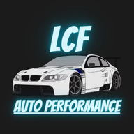

# LCF AUTO PERFORMANCE - Fullstack Web Application



## 🚗 À propos du projet
Application web complète pour le garage **LCF AUTO PERFORMANCE**, permettant la gestion des rendez-vous, le suivi des véhicules d'occasion, la facturation et la gestion fiscale.

## 🚀 Stack Technique
- **Frontend** : [Next.js 16](https://nextjs.org/) (App Router), [Tailwind CSS](https://tailwindcss.com/)
- **Backend** : [Firebase](https://firebase.google.com/) (Auth, Firestore, Storage, Functions)
- **Langage** : [TypeScript](https://www.typescriptlang.org/)
- **PWA** : Support hors-ligne et installation mobile
- **Emails** : [Resend](https://resend.com/) / [React Email](https://react.email/)

## 🛠️ Installation et Démarrage

### Pré-requis
- Node.js 18+
- Firebase CLI installed (`npm install -g firebase-tools`)

### Installation
1. Cloner le dépôt
2. Installer les dépendances :
   ```bash
   npm install
   cd functions && npm install && cd ..
   ```
3. Configurer les variables d'environnement (`.env.local`) :
   - `NEXT_PUBLIC_FIREBASE_API_KEY`
   - `NEXT_PUBLIC_FIREBASE_AUTH_DOMAIN`
   - ... (voir `src/lib/firebase/config.ts` pour la liste complète)

### Développement
Lancer le serveur de développement :
```bash
npm run dev
```

### Build Production
```bash
npm run build
```
*Note: Le flag `--webpack` est utilisé en interne car `next-pwa` nécessite Webpack (non compatible Turbopack actuellement).*

## 📂 Structure du projet
- `src/app` : Routes et pages (App Router)
- `src/components` : Composants UI réutilisables, composants Admin/Auth/Calendar
- `src/lib` : Logique Firebase, API, génération PDF, clients emails
- `functions/` : Cloud Functions pour les traitements serveurs
- `doc/` : Documentation détaillée par module

## 📖 Documentation
Pour plus de détails, consultez les fichiers dans le dossier `/doc` :
- [Cahier des charges global](./specifications.md)
- [Système de facturation](./doc/INVOICE_SYSTEM.md)
- [Module de devis](./doc/QUOTATIONS_MODULE.md)
- [Règles Firestore](./doc/FIRESTORE_RULES.md)

## ⚖️ Licence
Propriété exclusive de LCF AUTO PERFORMANCE.
